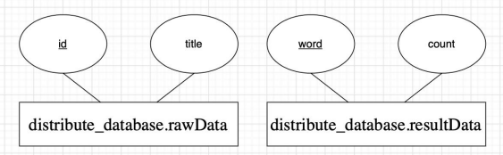

# distributed_system

# 1. 범위
## 1.1 시스템 목적
대용량의 txt파일을 대상으로 워드카운팅을 하는 프로그램을 만들어, 하나의 장비 보다는 여러 장비로 나누어 처리하는 것이 더 빠르다는 것을 보이기 위한 목적으로 시스템을 구상하였다.

## 1.2 주요 소프트웨어 기능
### 1. 분산저장기능
크롤링된 데이터가 client에 txt형태로 저장되어 있고, client에 연결된 n개의 server(server_DB)에 데이터를 분할 저장한다.
### 2. 필터링 
server에서는 워드카운팅을 하기 이전에 필터링 전처리 과정을 거친다. 두 번의 전처리 과정에서는 태그 및 간단한 특수문자를 제거하고 대소문자를 획일화한 뒤, 의미를 가지지 않는 단어들(명사, 동사, 형용사, 관사 등)을 제거하기 위해 형태소 분석 오픈라이브러리(enposta-0.5)를 사용했다.

### 3. 워드카운팅
필터링된 데이터에서는 결과적으로 문자가 공백단위로 구분돼 문장을 공백단위로 끊어서 배열을 생성해 문자를 구분했다. 이후 HashMap의 Key값을 문자로, key에 해당하는 내용을 횟수로 저장한 뒤 결과를 DB에 저장한다.

## 1.3 주요 설계 제약사항 및 한계
a. 동작환경
- Envs: VMware workstation player (이미지: Windows 10) 
- Tools: Intellij (java JDK-18) 
※ 사설 라이브러리 사용시 Linux에서 .jar 배포 불가능 → Windows 10에서 배포 
b. 개발환경 
<Service> <DataBase Server>

- Service
-- Envs: Windows 10
-- Tools: Intellij (java JDK-18)
- Server
-- Envs: Ubuntu 22.04
-- Tools: MariaDB 10.6.7
※ 개발은 각 팀원의 윈도우PC를 사용하였으며, DB서버를 따로 구축하여 팀원들의 개발이 용이하도록 하였다

# 설계
## 2.1 데이터 구조
데이터는 distribute_database로 이루어져 있고 각각 distribute_database.rawData 그리고 distribute_database.resultData로 이루어져 있다. rawData는 각 서버 database에 존재하며 id와 title을 갖고 있으며 id는 primary key역할을 한다.
resultData는 서버A에 존재하며 word값과 count 값을 갖고 있으며 word값이 primary key역할을 한다.

## 2.2 주요 클래스 설명
### 2.2.1 distribute_server 

2.2.1.1 RMI (RemoteInterface.java / RemoteServer.java / WordCounting.java)  
원격으로 메소드를 호출하기 위한 패키지. 서버는 원격으로 명령을 받아 메소드를 호출하고 그 연산을 수행하여야 하기 때문에 필터링 및 워드카운팅을 하는 코드가 구현되어야 하지만, 클라이언트는 코드가 구현되어 있을 필요는 없고 메소드에 기본적인 정보만 명시되어있기만 하면 된다.
  
2.2.1.2 DBConnection.java  
사용자 이름, 사용자의 비밀번호를 받아온 뒤 DB에 접속한다. 
 
2.2.1.3 dao (rawDataDao.java / resultDao.java) 
배열로 기존 DB 내역을 받아오고, 받은 RawData를 전송할 List를 생성한다.  
 
2.2.1.4 dto : rawDataDto.java / resultDto.java 
rawDataDto에서는 rawData의 id와 title을 받아오고 resultDto에서는 result의 word와 count를 받아온다. 
 
2.2.1.5 operation (Counting.java / Filtering.java) 
counting는 워드카운팅을 하기 위한 클래스이다. 띄어쓰기를 기준으로 단어 word 단위로 배열을 생성하고 키(word)를 기준으로 검사 후 중복 시 +1을 해준다.  
Filtering에서는 형태소 분석 라이브러리를 통해 필터링을 진행한다. 1차전처리에서 HTML 태그, ‘<content>’, 일부 특수문자를 제거한 후 처리된 데이터전체를 소문자로 변경한다. was, can 등 예외처리 단어를 판단하고 DB에 결과값을 전송한다.
 
### 2.2.4 distrbute_webclient 
2.2.4.1 DBcontroller.java  
IP, Port, DB이름, 계정, 패스워드를 받아 DB와의 세션을 수립한 후 DB연결에 필요한 데이터를 받고 저장한다. 
 
2.2.3.2 Operation (DistributeStorage.java / RemoteWordCounting.java) 
DistributeStorage에서는 서버별 컨트롤러를 생성하고 각 컨트롤러의 conn이 null이 아니면 접속 성공으로 간주 해 DB연결 현황을 확인한다. 연결된 DB가 하나도 없을 시 메인 메뉴로 돌아가고 DB가 있으면 각 DB를 초기화 한 후 워드카운팅을 위한 준비를 마친다. 그 후, rawData를 DB에 분산 저장한다. 
RemoteWordCounting에서는 호스트 정보와 총 개수를 불러와 호스트 정보를 저장하기 위한 배열을 선언한다. 원격메소드호출을 위한 객체 배열을 생성 후 각 호스트에 접근하며 RMI객체를 생성한다. 각 호스트에 원격으로 wordCounting함수 실행 명령을 하달한다. 
 
2.2.3.3 RMI (RemoteClient.java / RemoteInterface.java / WordCounting.java) 
RemoteClient에서 등록된 서버를 찾기 위해 Resgistry 객체를 생성한 후 사용할 객체를 불러온다. Remote의 객체로 리턴해주기 때문에 다운캐스팅을 해준다.  
 
2.2.4.2 RemoteWordCounting.java  
원격메소드호출을 위한 객체 배열을 생성 후 각 호스트에 접근하며 RMI객체를 생성한다. 각 호스트에 원격으로 wordCounting함수 실행 명령을 하달한다. 
 
2.2.4.3 RMI (RemoteClient.java / RemoteInterface.java / WordCounting.java) 
원격메소드호출을 위한 객체 배열을 생성 후 각 호스트에 접근하며 RMI객체를 생성한다. 각 호스트에 원격으로 wordCounting함수 실행 명령을 하달한다. RemoteClient에서 등록된 서버를 찾기 위해 Registy 객체를 생성한 후 사용할 객체를 불러온다. Remote의 객체로 리턴해주기 때문에 다운 캐스팅 해준다
